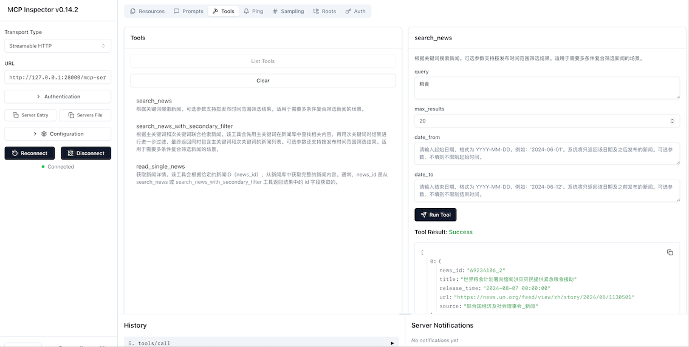

# Customized-Elasticsearch-MCP-Server

基于 Python `FastMCP` 和 `FastAPI` 的 自定义Elasticsearch MCP 服务Demo。

## 特性
- 支持关键词搜索、二次过滤、按 ID 查询
- 基于 FastMCP 提供 MCP 协议工具：`search_news`、`search_news_with_secondary_filter`、`read_single_news`
- Prometheus 监控集成（`starlette_prometheus`）
- 基于 Redis 的服务端 Session 存储（`RedisSessionMiddleware`）
- Docker 与 Docker Compose 支持
- 包含单元测试和集成测试


## 目录结构

```
.
├── src
│   └── news_mcp_server
│       ├── app.py               # FastAPI 应用入口
│       ├── mcp_server.py        # FastMCP 服务定义
│       ├── clients
│       │   └── elastic_client.py # 异步 ES 客户端
│       ├── services
│       │   └── news_service.py   # 业务逻辑封装
│       ├── middlewares
│       │   ├── auth.py           # 简单 Token 鉴权
│       │   ├── monitor.py        # Prometheus 中间件
│       │   └── session.py        # Session 中间件
│       ├── schemas
│       │   └── news.py           # Pydantic 数据模型
│       └── config
│           └── settings.py       # 环境配置
├── tests
│   ├── unit                      # 单元测试
│   └── integration               # 集成测试
├── Dockerfile                    # 容器构建配置
├── docker-compose.yml            # Docker Compose 配置
├── Makefile                      # 常用命令集
├── env.sample                    # 环境变量示例
├── pyproject.toml                # Python 项目配置
└── README.md                     # 项目说明
```

## 环境变量

复制 `env.sample` 为 `.env` 并配置：

```bash
cp env.sample .env
# 编辑 .env，至少需要以下变量：
# ES_API_KEY    Elasticsearch API Key（必填）
# ES_HOST       Elasticsearch 主机 URL（含端口）（必填）
# ES_INDEX      Elasticsearch 索引名称（必填）
# API_KEY       MCP 服务访问令牌（Bearer Token）（必填）
``` 


## 安装与运行

### 本地开发

1. 克隆项目并进入目录：
   ```bash
   git clone https://github.com/Coolgiserz/customized-elasticsearch-mcp-server
   cd customized-elasticsearch-mcp-server
   ```
2. 创建并激活虚拟环境：
   ```bash
   python3.12 -m venv .venv
   source .venv/bin/activate
   ```
3. 安装依赖：
   ```bash
   pip install -U pip
   pip install uv[all]
   uv sync
   ```
4. 启动服务（热重载）：
   ```bash
   make dev
   # 或者
   uv run uvicorn src.main:app --reload --host 0.0.0.0 --port 9009
   ```
5. 访问：
   - 健康检查: `GET http://localhost:9009/healthcheck`
   - Prometheus 指标: `GET http://localhost:9009/metrics`

### Docker & Docker Compose

- 构建镜像：
  ```bash
  make build
  ```
- 使用 Docker Compose 一键启动：
  ```bash
  make docker-build
  make docker-up
  ```
- 停止服务：
  ```bash
  make docker-down
  ```
- 日志查看：
  ```bash
  make docker-logs
  ```
- 默认映射端口：`28000 -> 8000`

## API 使用

### Healthcheck

```
GET /healthcheck
Response: {"status":"ok"}
```

### Prometheus Metrics

```
GET /metrics
```

### MCP 工具调用示例

使用 Python FastMCP 客户端调用 `search_news`：

```python
import asyncio
from fastmcp import Client

async def main():
    # 将 URL 替换为实际部署地址
    async with Client("http://localhost:9009/mcp-server") as client:
        tools = await client.list_tools()
        print("可用工具：", tools)

        result = await client.call_tool("search_news", {
            "query": "人工智能",
            "max_results": 5,
            "date_from": "2024-01-01",
            "date_to": "2024-12-31"
        })
        print(result)

asyncio.run(main())
```

## 测试

- 单元测试：
  ```bash
  make test
  ```
- 集成测试：
  ```bash
  pytest -q -m "integration"
  ```

## Makefile 常用命令

```bash
make init       # 初始化依赖
env sync        # 同步依赖（uv sync）
make dev        # 启动开发模式
make lint       # 代码检查
make format     # 代码格式化
make test       # 运行测试
dmake build     # 构建 Docker 镜像
``` 

## TODO
- 引入基于 JWT 或 OAuth2 的更安全鉴权机制
- 支持多进程/多实例共享会话（如使用 Redis Session Store）
- 优化 Elasticsearch 查询性能，添加缓存层（Redis）
- 增加端到端集成测试覆盖，并配置 CI/CD 流水线
- 支持 ES 聚合查询与热门关键词统计功能
- 提供 Swagger UI 或 Postman 集合示例

## License

本项目采用 MIT 许可证，详见 LICENSE。
